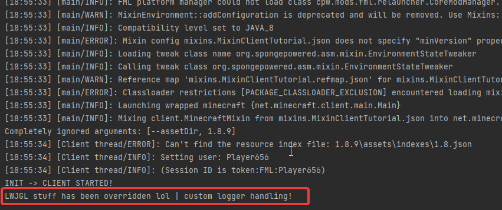

#  7 | Redirects
* * *

## What is `@Redirect`?

Consider the following code
```java  
private void anotherMethod() {
    Logger.info("Started method");

    Err error = doSomething();

    if (error.val().equals("ERROR")) {
        Logger.warning("There was an error!" + error.getMessage());
    }

    Logger.info("Ended method");
}
```

This computes a function, which then outputs an `Err`, which can have 3 states

- `OK`
- `ERROR`
- `WARNING`

Then the error message is logged as a warning if there is an error, what we want is for that to be logged as an error instead

Given current knowledge up to this tutorial, all we could do is `@Overwrite` this method, but like discussed earlier this should only be used if it's your only option, or the easiest option, as it's destructive, potentially introduces large compatibilities with other modifications and introduces a lot more code and `@Shadow`ing to your mixins

So what do we do instead?

Well, we can actually just redirect the `Logger.warning` method call to our own method

Luckily for us the `@Redirect` annotation that allows us to do this is incredibly simple :>

!!! note
    The parameters for your redirection functions have to be precisely the same as the original methods, you must also add the class as a parameter, in this example, `Logger`

```java  
@Redirect(method="anotherMethod()V", at = @At(
    value = "INVOKE",
    target = "LPath/To/Logger;warning(Ljava/lang/String;)V")) 
public void warningRedirector(Logger logger, String x) {
    Logger.err(x);
}
```

This simply redirects the `Logger.warning` method to our own function which outputs an error based on the parameters

The `method="anotherMethod()V"` is pretty simple, just the method we are going to modify

The `@At` annotation specifies what method that you would like to redirect

Even better is if you use slices to get the precise method

```java  
@Redirect(method="anotherMethod()V", 
    slice = @Slice(
            from = @At(
                value = "INVOKE",
                target="Lpath/To;val()Ljava/lang/String")
        ),
    at = @At(
            value = "INVOKE",
            target = "LPath/To/Logger;warning(java/lang/String;)V")
        ) 
public void warningRedirector(Logger logger, String x) {
    Logger.err(x);
}
```

* * *

## A practical example

Just like what we looked at last tutorial, in the `startGame` method in the `Minecraft` class, we looked at a logging statement for LWJGL and modified the arguments of that

This time we can redirect it and handle it in a custom way like shown

```java  
@Redirect(method = "startGame", at = @At(
        value = "INVOKE", target = "Lorg/apache/logging/log4j/Logger;info(Ljava/lang/String;)V", ordinal = 0))
private void info(Logger logger, String message) {
    System.out.println(message + " | custom logger handling!");
}
```

* * *
## Congrats, you know know how to implement redirects!



[Get the source code here](https://github.com/SkidKit/MixinClientTutorial)

* * *
